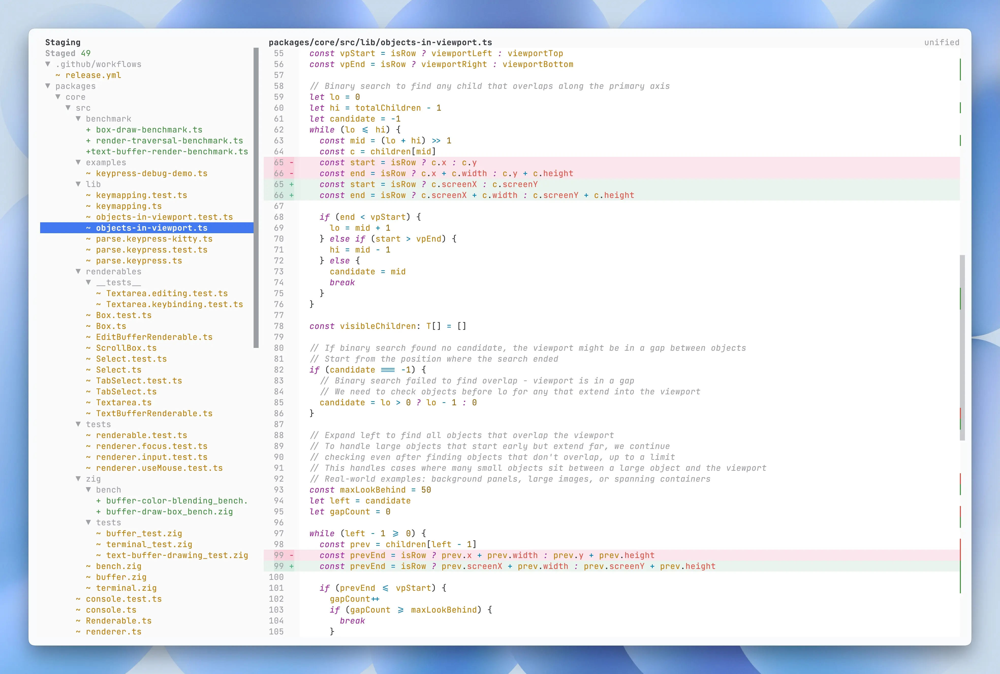
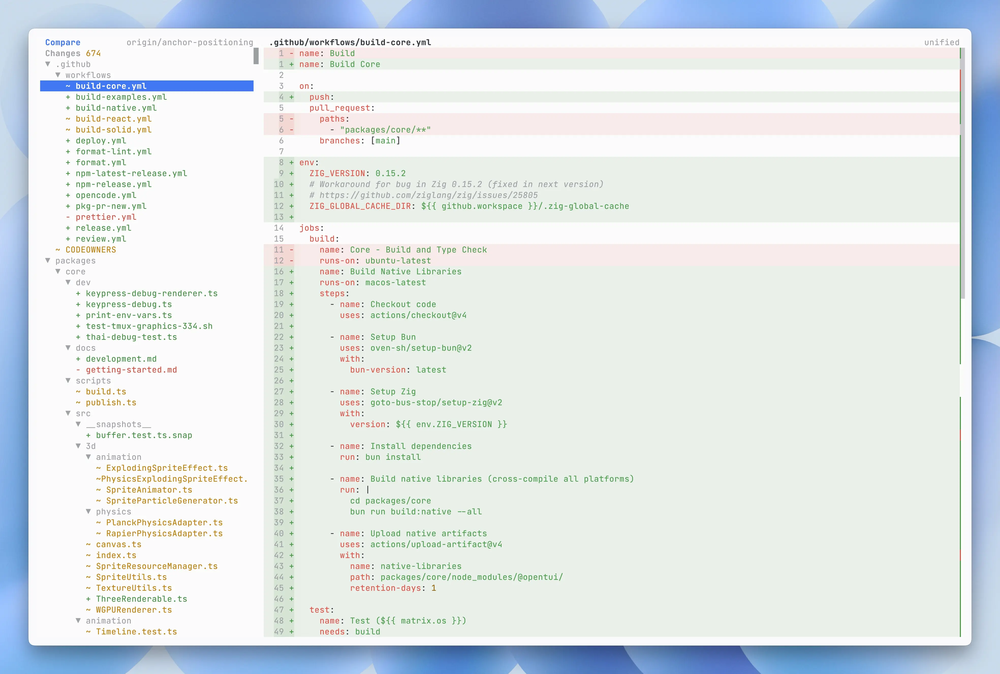
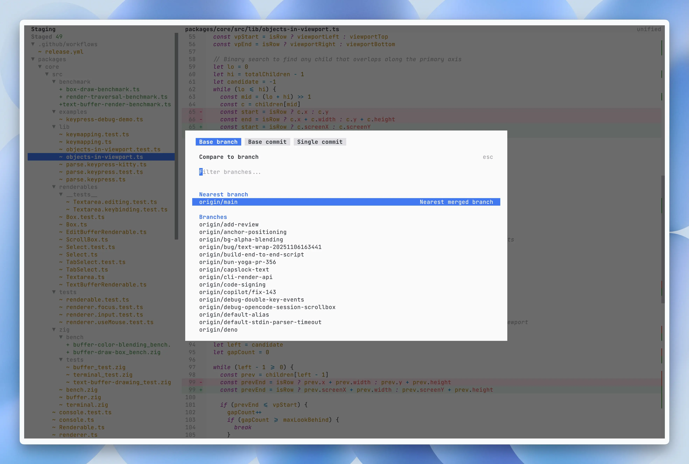

# gitcha

An early-preview Git UI for the terminal.

<video src="https://github.com/user-attachments/assets/9416d22c-4c2d-4acd-b2d7-88868b9a07e6" autoplay loop muted playsinline></video>

## About

`gitcha` is a terminal UI for source control review, modeled after the workflow people know from VS Code's Source Control panel.

It supports branch-based diff review, so you can inspect changes the way you would review a PR or MR before merging.

This project was built for an AI-heavy workflow, where it's important to be able to easily review the changes made by codeing agents.

With `gitcha`, the goal is to make that final review fast and focused.

## Preview





## Current Focus

- Source control overview for staged, unstaged, and untracked files
- Branch-based diff review for PR/MR-style inspection
- A VS Code-like source control workflow in the terminal
- Keyboard navigation with `h/j/k/l` or arrow keys
- More workflow features are being built out

## Quick Start

If you already have Bun installed, you can install or run `gitcha` directly:

```bash
# Installation
bun add -g gitcha
bunx gitcha

gitcha # usage
```

If you do not have Bun installed, use the install script instead:

```bash
curl -fsSL https://raw.githubusercontent.com/rin-yato/gitcha/main/install.sh | sh
```

Run `gitcha` from any git repository to get started.

## Status

`gitcha` is a preview project. The interface and feature set are expected to change as development continues.

## Contributing

Contributions are welcome. See [AGENTS.md](AGENTS.md) for development workflow details.

## License

MIT. See [LICENSE](LICENSE) for details.
